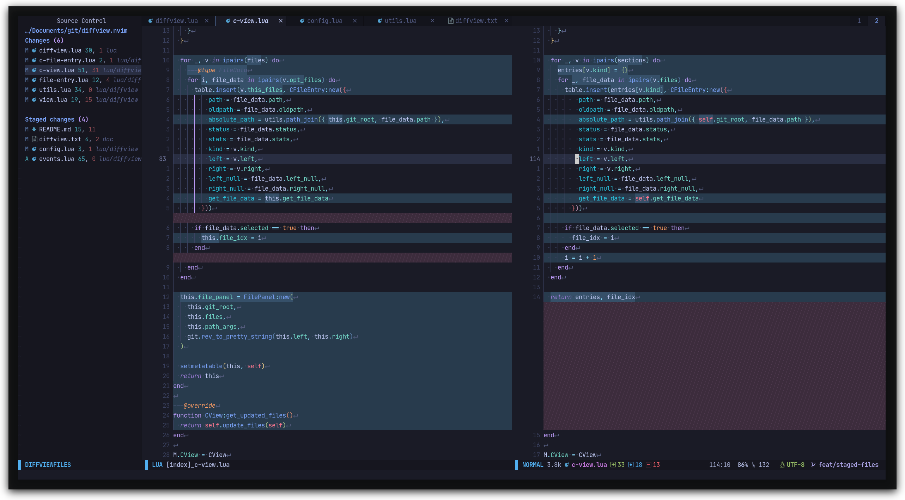

# Diffview.nvim

Single tabpage interface for easily cycling through diffs for all modified files
for any git rev.



## Introduction

Vim's diff mode is pretty good, but there is no convenient way to quickly bring
up all modified files in a diffsplit. This plugin aims to provide a simple,
unified, single tabpage interface that lets you easily review all changed files
for any git rev.

## Requirements

- Git
- Neovim >=0.5.0
- [nvim-web-devicons](https://github.com/kyazdani42/nvim-web-devicons) (optional) For file icons

## Installation

Install the plugin with your package manager of choice.

```vim
" Plug 
Plug 'sindrets/diffview.nvim'
```

```lua
-- Packer
use 'sindrets/diffview.nvim'
```

## Configuration

```lua
-- Lua
local cb = require'diffview.config'.diffview_callback

require'diffview'.setup {
  diff_binaries = false,    -- Show diffs for binaries
  file_panel = {
    width = 35,
    use_icons = true        -- Requires nvim-web-devicons
  },
  key_bindings = {
    disable_defaults = false,                   -- Disable the default key bindings
    -- The `view` bindings are active in the diff buffers, only when the current
    -- tabpage is a Diffview.
    view = {
      ["<tab>"]     = cb("select_next_entry"),  -- Open the diff for the next file 
      ["<s-tab>"]   = cb("select_prev_entry"),  -- Open the diff for the previous file
      ["<leader>e"] = cb("focus_files"),        -- Bring focus to the files panel
      ["<leader>b"] = cb("toggle_files"),       -- Toggle the files panel.
    },
    file_panel = {
      ["j"]             = cb("next_entry"),         -- Bring the cursor to the next file entry
      ["<down>"]        = cb("next_entry"),
      ["k"]             = cb("prev_entry"),         -- Bring the cursor to the previous file entry.
      ["<up>"]          = cb("prev_entry"),
      ["<cr>"]          = cb("select_entry"),       -- Open the diff for the selected entry.
      ["o"]             = cb("select_entry"),
      ["<2-LeftMouse>"] = cb("select_entry"),
      ["-"]             = cb("toggle_stage_entry"), -- Stage / unstage the selected entry.
      ["S"]             = cb("stage_all"),          -- Stage all entries.
      ["U"]             = cb("unstage_all"),        -- Unstage all entries.
      ["X"]             = cb("restore_entry"),      -- Restore entry to the state on the left side.
      ["R"]             = cb("refresh_files"),      -- Update stats and entries in the file list.
      ["<tab>"]         = cb("select_next_entry"),
      ["<s-tab>"]       = cb("select_prev_entry"),
      ["<leader>e"]     = cb("focus_files"),
      ["<leader>b"]     = cb("toggle_files"),
    }
  }
}
```

The diff windows can be aligned either with a horizontal split or a vertical
split. To change the alignment add either `horizontal` or `vertical` to your
`'diffopt'`.

Most of the file panel mappings should also work from the view if they are
added to the view bindings (and vice versa). The exception is for mappings
that only really make sense specifically in the file panel, such as
`next_entry`, `prev_entry`, and `select_entry`. Functions such as
`toggle_stage_entry` and `restore_entry` work just fine from the view. When
invoked from the view, these will target the file currently open in the view
rather than the file under the cursor in the file panel.

## Usage

### `:DiffviewOpen [git rev] [args] [ -- {paths...}]`

Calling `:DiffviewOpen` with no args opens a new Diffview that compares against
the current index. You can also provide any valid git rev to view only changes
for that rev. Examples:

- `:DiffviewOpen`
- `:DiffviewOpen HEAD~2`
- `:DiffviewOpen HEAD~4..HEAD~2`
- `:DiffviewOpen d4a7b0d`
- `:DiffviewOpen d4a7b0d..519b30e`

You can also provide additional paths to narrow down what files are shown:

- `:DiffviewOpen HEAD~2 -- lua/diffview plugin`

For information about additional `[args]`, visit the [documentation](https://github.com/sindrets/diffview.nvim/blob/main/doc/diffview.txt).

Additional commands for convenience:

- `:DiffviewClose`: Close the current diffview. You can also use `:tabclose`.
- `:DiffviewToggleFiles`: Toggle the files panel.
- `:DiffviewFocusFiles`: Bring focus to the files panel.
- `:DiffviewRefresh`: Update stats and entries in the file list of the current
  Diffview.

With a Diffview open and the default key bindings, you can cycle through changed
files with `<tab>` and `<s-tab>` (see configuration to change the key bindings).

## Tips

- **Hide untracked files:**
  - `DiffviewOpen -uno`
- **Exclude certain paths:**
  - `DiffviewOpen -- :!exclude/this :!and/this`
- **Run as if git was started in a specific directory:**
  - `DiffviewOpen -C/foo/bar/baz`
- **Diff the index against a git rev:**
  - `DiffviewOpen HEAD~2 --cached`
  - Defaults to `HEAD` if no rev is given.

## Restoring Files

If the right side of the diff is showing the local state of a file, you can
restore the file to the state from the left side of the diff (key binding `X`
from the file panel by default). The current state of the file is stored in the
git object database, and a command is echoed that shows how to undo the change.
